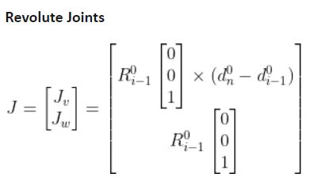
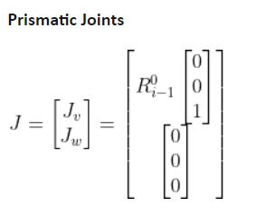
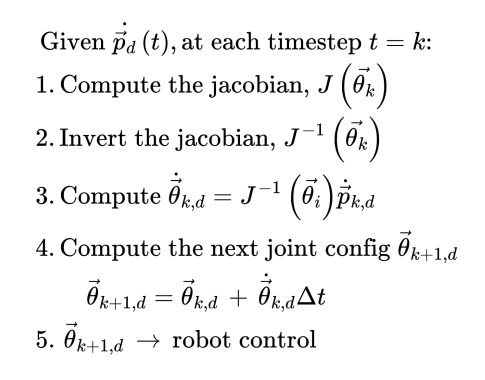

# Mini Project 1: 
## Forward Position and Velocity Kinematics on a 5-DOF Hiwonder Robot Arm
For a 5-DOF robot arm of serial links, apply forward position and velocity kinematics to control motion of the robot arm with a gamepad.

This mini project could be separated into 3 separate problems which are listed and explained below. For the report that details how we approached and implemented each of our solutions including links to videos, see [this document.](https://docs.google.com/document/d/13dFPQtsWIF-s6bF55bizwVpNnhvOx7KRk7ooc8nubO8/edit?usp=sharing)
***

### Problem 1 

**Derive the DH parameters and table for the 5DOF robot platform**

DH parameters (Denavit-Hartenberg parameters) refer to the specific relationship between a coordinate frame i and the coordinate frame i-1 before it. A table is created with a row for each joint, and a column for these 4 variables:

- theta: the angle between x(i-1) and x(i) about z(i-1)
- d: the distance from the origin of frame i-1 to x(i) along z(i-1)
- a: the distance between z(i-1) and z(i) along x(i)
- alpha: the angle between z(i-1) and z(i) about x(i)

They rely on specific rules being followed when coordinate frames are assigned. These rules are taken from [Automatic Addison.](https://automaticaddison.com/how-to-assign-denavit-hartenberg-frames-to-robotic-arms/)

1. The z-axis of each joint's coordinate frame is the axis of rotation for a revolute joint, and the direction of motion for a prismatic joint.
2. The x-axis must be perpendicular to both the current and previous z-axes.
3. The y-axis is determined through the right-hand-rule.
4. The x-axis must intersect the previous z-axis (this does not apply to frame 0).

A 5 Degree-of-Freedom robot platform will have 6 frames (including the end-effector), and 5 rows in its DH table.

&nbsp;  

**Derive the FPK equations and implement in software (with verification in the Viz tool)**

FPK stands for forward position kinematics. FPK equations allow us to determine the position of a robot arm's end-effector (EE) based on the position of its joints. There are two approaches to finding these equations: 
1. A geometric approach, where an equation for each component of the EE's position in the world coordinate frame is derived based on the geometric relationships of the joints and links.
2. Using homogenous transformation matrices (HTMs). HTMs allow both rotation and translation to be performed on a vector in a single operation. We use them to describe the relationship between two different coordinate frames. 

We use homogeneous transformation matrices because they can be defined with the DH parameters. They can also be mutliplied together such that if all frames on a robot arm are multiplied together, a new HTM can describe the relationship from the origin frame to the EE frame.

An HTM for a joint can be formed by plugging these values from that joint's row in the DH table into a matrix (c is an abbreviation for cosine, and s is an abbreviation for sine):

Several HTMs can be multiplied together to combine the transformation across several joints into one new matrix.

***
### Problem 2

**Derive the inverse Jacobian matrix**

The Jacobian matrix is a way to relate the velocities of the robot arm's joints to the EE velocities. The Jacobian matrix has a column for each joint. Some set of rows are related to the linear velocity for each position component at that joint, and some set of rows are related to the angular velocity for each position component at that joint.

Each column of the Jacobian is found one of these two ways (images from [Automatic Addison](https://automaticaddison.com/the-ultimate-guide-to-jacobian-matrices-for-robotics/)):

Because our robot arm only has revolute joints, we will use the equation for the revolute joint components exclusively. The HTM for each joint has embedded in it a rotation matrix and translation vector, so we will be able to index our HTMs for the necessary pieces to assemble our Jacobian matrix.

Because we only care about the linear velocities for the purposes of integration with the gamepad, we only use the linear component of the equation above and the final Jacobian we use in the rest of our calculations is a 5x3 matrix.

We require the inverse Jacobian matrix because we want to determine and feed joint velocities to our robot arm based on an EE velocity we give it. However, the Jacobian is not a square matrix. Luckily, numpy contains a function pinv which gives the pseudo-inverse which we use instead.

&nbsp;  

**Implement a resolved-rate motion control (RRMC) with verification in the Viz tool**

RRMC is a way to bypass doing inverse kinematics to assign joint velocities. It allows the EE to move smoothly between waypoints. At each time step, an inverse Jacobian is calculated to update the joint velocities.

The control loop is as follows:

Given the velocity of the end-effector,
1. Compute the Jacobian
2. Invert the Jacobian
3. Compute the joint velocities with the inverse Jacobian and EE velocity
4. Compute the next joint positions (their current positions plus the velocities you have found they will move times the time step this loop operates at)
5. Control each joint to move to the new joint positions

Implementing this successfully allows the forward velocity kinematics to be used in the viz tool.

***

### Problem 3

**Implement the resolved-rate motion control (RRMC) through gamepad control of the 5DOF robot hardware**

The gamepad is mapped to control the end-effector like this:

For the robot control portion of this project, see [this repository.](https://github.com/EarlJr53/hiwonder-armpi-pro)

***
&nbsp;  

# Mini Project 2: 
## Inverse Kinematics on a 5-DOF Hiwonder Robot Arm
For a 5-DOF robot arm of serial links, derive and apply inverse kinematics to control motion of the robot arm in a visualizer.

This mini project could be separated into 2 separate problems which are listed and explained below. The original project assignment included hardware implementation and cartesian path following.

For a more detailed report, including links to videos of our solutions, see [this document.](https://docs.google.com/document/d/1A_wgNYVis8AAcTqrpjcJaM28Ba-v3_7NMp4jH0C_Y7o/edit?usp=sharing)

***
### Problem 1 

**Derive the analytical IK equations for the 5DOF robot**

Inverse kinematics equations take a given end-effector position and find the position of each joint the robot arm should be at in order to accomplish that position.

We used a combination of a geometric approach and matrix math like we used in problem 1 of Mini Project 1 to find the equations for each of the joint angles. 

We used a geometric approach to derive thetas 1-3 in terms of the position of the wrist (Joint 4) which can be found by moving along the z-axis of the end-effector's coordinate frame by the lengths of Link 4 + Link 5. Using Xw, Yw, and Zw as placeholder values and the diagram above, we found these equations for thetas 1-3:

Where alpha, phi, and r are as follows:

To find thetas 4 and 5, we used the fact that the transpose of the rotation matrix from frames 0 to 3 (which we can find numerically because we now have thetas 1-3) multiplied by the rotation matrix from frames 0 to 5 (which we can also find numerically find because we have the end-effector's position including its Euler angles) will give us the rotation matrix from frames 3 to 5. This is also equivalent to the rotation matrix from frames 3 to 4 multiplied by the rotation matrix from frames 4 to 5, which we can find symbolically via our DH table. When we relate the symbolic rotation matrix to the numerical rotation matrix, we're able to find equations for thetas 4 and 5:

**Implement the analytical IK equations in the Viz tool and demonstrate the different solutions**

We found that there are four different solutions depending on whether theta 1 is one value or that value plus pi radians (turned around 180 degrees), and if the robot arm is positioned elbow-up or elbow-down.

### Problem 2 

**Define the numerical IK algorithm for the 5DOF robot**

A numerical IK algorithm is an iterative approach that finds a collection of joint angles such that the given end-effector position and the calculated end-effector position are the same.

The method we will follow is the Newton Raphson Method:

**Compare the results between analytical and numerical IK**

Generally, the numerical IK solver is more transferrable between different styles of robot platforms, but it can take significantly longer to solve. Some cases don't have an analytical solution at all in which case a numerical solution is necessary. A numerical IK solver usually converges on one solution, which means that you lose the dexterity of elbow up or down solutions. It can also sometimes fall into a local minima and not reach a viable solution at all.

We were able to use the Jacobian we had already calculated and did not need to make new changes based on the robot arm's geometry. Our observations aligned with what we would expect, where the numerical IK solver took much longer to come up with one solution (especially when the seed needed to be re-randomized).