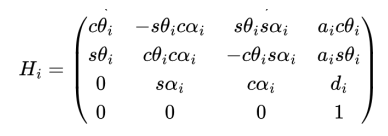

# Mini Project 1: 
## Forward Position and Velocity Kinematics on a 5-DOF Hiwonder Robot Arm
For a 5-DOF robot arm of serial links, apply forward position and velocity kinematics to control motion of the robot arm with a gamepad.

***fix link to report to be view only verison, include gif of robot moving here***

This mini project could be separated into 3 separate problems which are listed and explained below. For the report that details how we approached and implemented each of our solutions, see [this document.](https://docs.google.com/document/d/13dFPQtsWIF-s6bF55bizwVpNnhvOx7KRk7ooc8nubO8/edit?usp=sharing)
***

### Problem 1 
**Derive the DH parameters and table for the 5DOF robot platform**

DH parameters (Denavit-Hartenberg parameters) refer to the specific relationship between a coordinate frame i and the coordinate frame i-1 before it. A table is created with a row for each joint, and a column for these 4 variables:

- theta: the angle between x(i-1) and x(i) about z(i-1)
- d: the distance from the origin of frame i-1 to x(i) along z(i-1)
- a: the distance between z(i-1) and z(i) along x(i)
- alpha: the angle between z(i-1) and z(i) about x(i)

They rely on specific rules being followed when coordinate frames are assigned. These rules are taken from [Automatic Addison.](https://automaticaddison.com/how-to-assign-denavit-hartenberg-frames-to-robotic-arms/)

1. The z-axis of each joint's coordinate frame is the axis of rotation for a revolute joint, and the direction of motion for a prismatic joint.
2. The x-axis must be perpendicular to both the current and previous z-axes.
3. The y-axis is determined through the right-hand-rule.
4. The x-axis must intersect the previous z-axis (this does not apply to frame 0).

A 5 Degree-of-Freedom robot platform will have 6 frames (including the end-effector), and 5 rows in its DH table.

&nbsp;  

**Derive the FPK equations and implement in software (with verification in the Viz tool)**

FPK stands for forward position kinematics. FPK equations allow us to determine the position of a robot arm's end-effector (EE) based on the position of its joints. There are two approaches to finding these equations: 
- A geometric approach, where an equation for each component of the EE's position in the world coordinate frame is derived based on the geometric relationships of the joints and links.
- Using homogenous transformation matrices (HTMs). HTMs allow both rotation and translation to be performed on a vector in a single operation. We use them to describe the relationship between two different coordinate frames. 

We use homogeneous transformation matrices because they can be defined with the DH parameters. They can also be mutliplied together such that if all frames on a robot arm are multiplied together, a new HTM can describe the relationship from the origin frame to the EE frame.

An HTM for a joint can be formed by plugging these values from that joint's row in the DH table into a matrix (c is an abbreviation for cosine, and s is an abbreviation for sine):

Several HTMs can be multiplied together to combine the transformation across several joints into one new matrix.

***
### Problem 2

**Derive the inverse jacobian matrix and implement a resolved-rate motion control (RRMC) with verification in the Viz tool**

***put in jacobian stuff, explain what an RRMC is, mention viz tool***

***

### Problem 3

**Implement the resolved-rate motion control (RRMC) through gamepad control of the 5DOF robot hardware**

***talk about gamepad stuff***